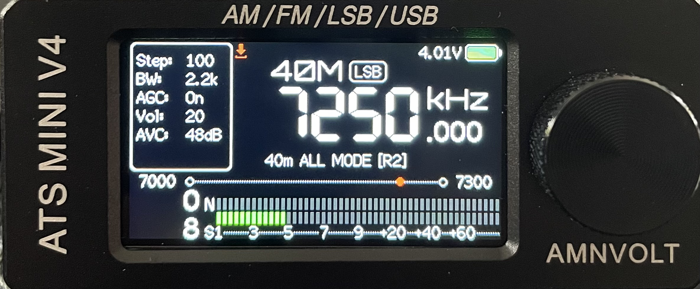
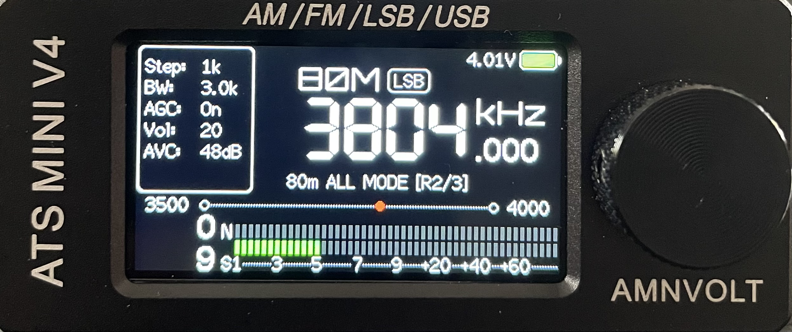
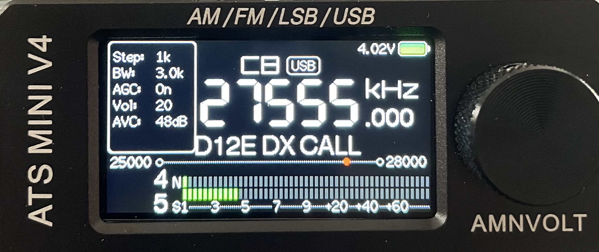

# ATS Mini - F4DHY Mod

Personal modification of the ATS Mini firmware, based on the official
[esp32-si4732/ats-mini](https://github.com/esp32-si4732/ats-mini) project.

Developed and tested on an **ATS Mini V4 / AMNVolt V4** using the **ESP32-S3 OSPI** build.

## F4DHY Mod features

This fork currently includes:

* Improved **WiFi / NTP Sync Only** behavior and status messages
* Improved **battery gauge** with continuous indication and low-battery warning
* **HF amateur band context** directly displayed on the radio screen
* **IARU regional context** where band limits differ
* **11m / CB context** while preserving the original CB channel identification
* Existing **EiBi station identification, FT8 and SSTV frequency identification** remain available and have priority over generic band context

---

## WiFi / NTP synchronization

The `Sync Only` function could be difficult to diagnose when the WiFi connection was weak or unreliable.

In this situation, the receiver could return to the main radio screen without updating the clock. Although the original firmware already displayed a `No WiFi connection` message when the connection failed, the message disappeared almost immediately in `Sync Only` mode, making the failure easy to miss.

The `Sync Only` behavior has been improved to provide clearer feedback and make NTP synchronization more robust.

### Changes

* Added a 2-second delay after a successful WiFi connection before starting NTP synchronization
* Increased NTP synchronization attempts from 10 to 30
* Added an explicit `NTP Sync OK` message when synchronization succeeds
* Added an explicit `NTP Sync FAILED` message when WiFi is connected but NTP synchronization fails
* The original `No WiFi connection` message is now kept visible for 2 seconds when the WiFi connection fails
* WiFi is automatically disconnected after synchronization, as in the original firmware

The result is a clearer `Sync Only` sequence:

* WiFi connection fails: `No WiFi connection`
* WiFi connects but NTP fails: `NTP Sync FAILED`
* WiFi and NTP succeed: `NTP Sync OK`

Each result remains visible before the receiver returns to the main radio screen.

---

## Battery gauge modification

This version improves the battery indicator behavior on the ATS Mini.

### Changes

* Continuous battery gauge instead of the original steps
* Linear indication between **3.30 V and 3.95 V**
* **3.95 V** considered as a full battery
* The last two pixels of the gauge are displayed in the low-battery color
* Low battery warning at **3.30 V**
* LOW state clears at **3.33 V**
* **30 mV hysteresis** prevents the LOW state from oscillating around the threshold
* Empty battery icon flashes every **500 ms** when battery is low
* Battery voltage remains displayed in red during the LOW warning
* Original USB charging indication is preserved

The modification was developed and tested on an ATS Mini V4 using the ESP32-S3 OSPI build.

A full discharge test showed approximately **8 hours of runtime**, with no noticeable battery-life degradation compared with the original firmware.

---

## HF / CB Band Context

The F4DHY Mod adds automatic frequency context to the station-name area of the main radio screen.

When no more specific identification is available, the receiver displays the current amateur band and the general type of operation associated with that part of the band.

Examples:

```text
7.020 MHz   → 40m CW
7.045 MHz   → 40m DIGI
7.150 MHz   → 40m ALL MODE
7.250 MHz   → 40m ALL MODE [R2]

14.050 MHz  → 20m CW
14.100 MHz  → 20m DIGI
14.200 MHz  → 20m ALL MODE

27.555 MHz  → D12E DX CALL

28.200 MHz  → 10m BEACON
29.400 MHz  → 10m SAT
```

### Supported HF bands

Band context is currently provided for:

* 160m
* 80m
* 60m
* 40m
* 30m
* 20m
* 17m
* 15m
* 12m
* 11m / CB
* 10m

Depending on the frequency, the displayed context can include:

* `CW`
* `DIGI`
* `VOICE`
* `ALL MODE`
* `BEACON`
* `SAT`
* `CB/DX`

### IARU regions

Where amateur allocations differ between IARU regions, the region is displayed directly on screen.

Examples:

```text
80m ALL MODE [R2/3]
40m ALL MODE [R2]
```

`[R1]`, `[R2]` and `[R3]` refer to **IARU Regions 1, 2 and 3**.

When no region is displayed, the context applies to all three regions in the simplified band-context database.

### Identification priority

The Band Context feature is designed as a fallback and does not replace more useful information already provided by the firmware.

Identification priority is:

1. Known named frequencies such as **FT8, SSTV and DX CALL**
2. Original **CB channel identification**
3. Active **EiBi station**
4. Generic **HF / CB Band Context**

This means, for example:

```text
7.074 MHz  → FT8
7.165 MHz  → SSTV
27.555 MHz → D12E DX CALL
27.700 MHz → SSTV
28.074 MHz → FT8
```

while other frequencies automatically fall back to their corresponding band context.

### Important note

The Band Context display is intended as a **quick visual frequency reference only**.

Band plans, allocations, operating modes and transmitting privileges may vary by country, licence class and local regulation.

**Always refer to the applicable national regulations and current official band plans before transmitting.**

### Screenshots

#### IARU Region 2 context


*40m at 7.250 MHz showing the Region 2 specific extension.*

#### IARU Regions 2/3 context


*80m at 3.804 MHz showing availability specific to IARU Regions 2 and 3.*

#### 27.555 MHz DX calling frequency


*Dedicated display for the well-known 27.555 MHz USB DX calling frequency.*


---

## Firmware

A precompiled **OSPI firmware** is available in the Releases section.

> This is an unofficial modification and is not affiliated with or supported by the original ATS Mini project.

---


# ATS Mini


This firmware is for use on the SI4732 (ESP32-S3) Mini/Pocket Receiver

Based on the following sources:

* Volos Projects:    https://github.com/VolosR/TEmbedFMRadio
* PU2CLR, Ricardo:   https://github.com/pu2clr/SI4735
* Ralph Xavier:      https://github.com/ralphxavier/SI4735
* Goshante:          https://github.com/goshante/ats20_ats_ex
* G8PTN, Dave:       https://github.com/G8PTN/ATS_MINI

## Releases

Check out the [Releases](https://github.com/esp32-si4732/ats-mini/releases) page.

## Documentation

The hardware, software and flashing documentation is available at <https://esp32-si4732.github.io/ats-mini/>

## Discuss

* [GitHub Discussions](https://github.com/esp32-si4732/ats-mini/discussions) - the best place for feature requests, observations, sharing, etc.
* [TalkRadio Telegram Chat](https://t.me/talkradio/174172) - informal space to chat in Russian and English.
